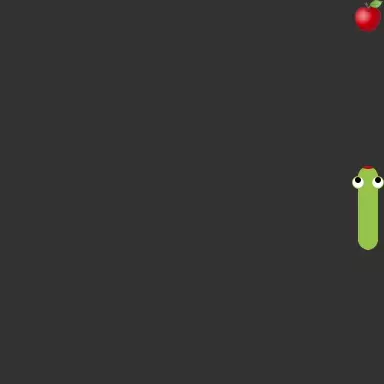

# Snake Deep Reinforcement Learning

## Description

This is a
simple [deep reinforcement learning](https://en.wikipedia.org/wiki/Deep_reinforcement_learning)
project. The project implemented
the [Snake game](https://en.wikipedia.org/wiki/Snake_(video_game_genre)) as
an [OpenAI Gym environment](https://www.gymlibrary.dev/). Deep learning is implemented using
the [RLlib library](https://docs.ray.io/en/latest/rllib/index.html).
A [convolutional neural network](https://en.wikipedia.org/wiki/Convolutional_neural_network) is used
to work with game frames.
 

## Google Colab

Training
in [Colab notebook](https://colab.research.google.com/drive/1AA4h3tCovuy1H52hPi7iAPiup2AgteNP?usp=sharing)
 

## Installing dependencies

The project uses **Python 3.7**.
 
 
`pip install -r requirements.txt`
 

## Train

`python train.py`
 

## Play

Example:
 
`python play.py checkpoint_example/checkpoint-100`